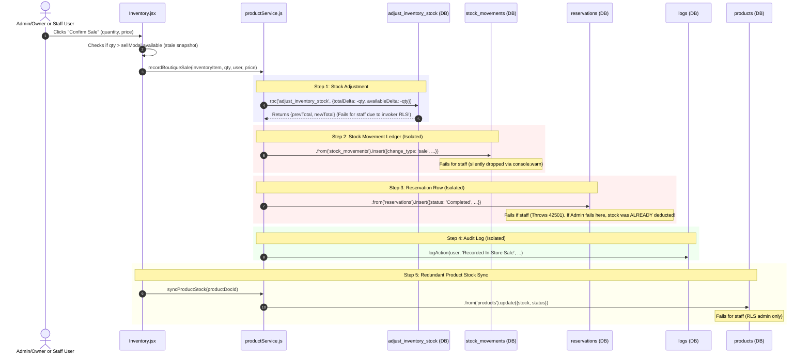

# Phase B3-a: Inventory & Walk-in Sales Writer & Live Catalog Inventory
**Audit Mode:** READ-ONLY TRACE  
**Date:** September 8, 2026  
**Status:** AUDIT FINAL (Baseline for Phase B3 Architecture)

---

## 1. Scope

This audit provides an exhaustive, read-only trace of all mutation paths, live PostgreSQL catalog invariants, transaction boundaries, and authorization rules governing:
- `public.inventory` (Garment variant stock bins)
- `public.products` (Parent catalog items and derived stock totals)
- `public.stock_movements` (Audit ledger of stock changes)
- `public.reservations` (Customer reservations and in-store walk-in sales)
- `public.reservation_items` (Reservation line items)
- `public.color_list` & `public.pattern_list` (Lookup attribute lists)

### Code Surfaces Audited
- `admin-dashboard/src/pages/catalog/Inventory.jsx`
- `admin-dashboard/src/pages/catalog/ProductForm.jsx`
- `admin-dashboard/src/services/productService.js`
- `admin-dashboard/src/services/inventoryService.js`
- `admin-dashboard/src/services/variantService.js`
- `admin-dashboard/src/services/reservationService.js`
- `jezsy-mobile-app/src/components/EditVariantModal.tsx`
- Live PostgreSQL Catalog (Supabase project `wufcmtndotfvxvvxkamv`)

---

## 2. Domain Objects and Stock Source-of-Truth

### 2.1 The Canonical Stock Unit: `public.inventory`
The canonical retail unit of stock is the **variant row** in `public.inventory`, defined by the tuple `(product_doc_id, size, color, pattern)`.

```text
Product (Parent)
 └── Inventory Variant 1: Size S, Color Black, Pattern Plain -> total: 10, reserved: 2, available: 8
 └── Inventory Variant 2: Size M, Color Black, Pattern Plain -> total: 5,  reserved: 0, available: 5
```

#### Database-Enforced Invariants (`public.inventory` CHECK Constraints)
1. `inventory_available_matches_total_reserved_check`:
   ```sql
   CHECK (available = (total - reserved))
   ```
2. `inventory_available_nonnegative_check`:
   ```sql
   CHECK (available >= 0)
   ```
3. `inventory_nonnegative_check`:
   ```sql
   CHECK (total >= 0 AND reserved >= 0 AND reserved <= total)
   ```

### 2.2 Derived State: `public.products.stock` & `status`
- `products.stock` is a **purely derived denormalized aggregate** representing `SUM(available)` across non-deleted variants belonging to that product.
- `products.status` is a derived indicator:
  - `available <= 0 AND reserved > 0` $\rightarrow$ `'Reserved'`
  - `available <= 0 AND reserved = 0` $\rightarrow$ `'Out of Stock'`
  - `available > 0` $\rightarrow$ `'In Boutique'`
- **Authoritative Database Mechanism**: The database **already possesses** an automated trigger:
  - Trigger `trg_sync_product_stock_from_inventory` on `public.inventory` (`AFTER INSERT OR UPDATE OR DELETE`)
  - Calls `SECURITY DEFINER` function `public.sync_product_stock(product_doc_id)`
  - Recomputes `products.stock` and `products.status` automatically on any mutation to `inventory`.

### 2.3 The Immutable Audit Ledger: `public.stock_movements`
- Purpose: Append-only audit record of stock adjustments, sales, restocks, and corrections.
- Database Invariants:
  - `stock_movements_change_type_check`: `CHECK (change_type IN ('manual_adjustment', 'restock', 'correction', 'sale', 'reservation'))`
  - `stock_movements_immutable`: `CHECK (updated_at = created_at)`
  - Trigger `stock_movements_prevent_updates_trigger`: Blocks `UPDATE` and `DELETE` queries.
- **Structural Deficiency**: `stock_movements` currently links to `product_id` (the parent product), but has **no `inventory_id` column** linking to the specific variant that was adjusted. Variant details are historically relegated to unstructured string notes.
- **Critical Architectural Fact**: There is **no automatic trigger** on `inventory` that appends to `stock_movements`. The ledger depends entirely on callers explicitly executing `INSERT INTO stock_movements`.

### 2.4 Walk-in Sales Domain Model
- Walk-in sales do **not** have a dedicated `sales` or `orders` table.
- Instead, the application inserts a record directly into `public.reservations`:
  - `status = 'Completed'`
  - `customer_name = 'Walk-in Customer'`
  - `customer_id = NULL`
  - `rental_price = salePrice`
  - `deleted = false`
- Crucially, walk-in sales **do not insert into `reservation_items`**.
- Because the reservation row is inserted directly with status `'Completed'`, the reservation status change trigger `trg_apply_inventory_on_reservation_status` (which is `AFTER UPDATE`) **does not fire**.
- `Analytics.jsx` and `ProductForm.jsx` consume completed reservations for revenue metrics and order history. Preserving this representation for Phase B3 avoids destabilizing reporting pipelines.

---

## 3. Comprehensive Writer Inventory

| ID | Table | Operation | Code Location (File:Line) | Invoking UI Action | Underlying Primitive | Auth & RLS Context | Transaction Boundary |
|---|---|---|---|---|---|---|---|
| **W-INV-01** | `inventory` | `UPDATE` (delta) | `productService.js:156` | `Inventory.jsx:578` (Restock) | `supabase.rpc('adjust_inventory_stock')` | **FAIL-CLOSED FOR STAFF**: RPC checks `is_staff_or_admin()`, but runs as `SECURITY INVOKER`; `inventory` table RLS requires `is_admin_or_owner()`. | Single statement (`FOR UPDATE` locked) |
| **W-INV-02** | `inventory` | `UPDATE` (delta) | `productService.js:306` | `Inventory.jsx:626` (Sell) | `supabase.rpc('adjust_inventory_stock')` | Same as W-INV-01; executed inside client `recordBoutiqueSale` | Isolated RPC call; non-atomic with downstream sale steps |
| **W-INV-03** | `inventory` | `UPDATE` (soft delete) | `productService.js:219` | `Inventory.jsx:642` (Archive) | `updateDocument('inventory')` $\rightarrow$ `.from('inventory').update({ deleted: true })` | `is_admin_or_owner()` required by RLS | Direct DML (no transaction, no automatic ledger entry) |
| **W-INV-04** | `inventory` | `UPDATE` (restore) | `productService.js:231` | `Inventory.jsx:667` (Restore) | `updateDocument('inventory')` $\rightarrow$ `.from('inventory').update({ deleted: false })` | `is_admin_or_owner()` required by RLS | Direct DML (no transaction, no automatic ledger entry) |
| **W-INV-05** | `inventory` | `UPDATE` (arbitrary) | `productService.js:131` | Legacy callers / edit | `updateDocument('inventory')` $\rightarrow$ `.from('inventory').update(updates)` | `is_admin_or_owner()` required by RLS | Direct DML; bypasses delta math & stock ledger |
| **W-INV-06** | `inventory` | `UPDATE` (soft delete) | `ProductForm.jsx:586, 623` | Form Save (variant removal) | `supabase.from('inventory').update({ deleted: true, ... }).in('id', ...)` | `is_admin_or_owner()` required by RLS | Direct DML from presentation component |
| **W-INV-07** | `inventory` | `INSERT` | `variantService.js:198` | `ProductForm.jsx:598` (Add size/variant) | `supabase.from('inventory').insert(payload)` | `is_admin_or_owner()` required by RLS | Direct DML; sets initial stock to 0 |
| **W-INV-08** | `inventory` | `INSERT` (bulk) | `productService.js:540` | `ProductForm.jsx` (New product save) | `supabase.from('inventory').insert(newVariantsToCreate)` | `is_admin_or_owner()` required by RLS | Direct DML; races with DB trigger `trg_seed_inventory_on_product_insert` |
| **W-INV-09** | `inventory` | `UPDATE` (sync category) | `productService.js:102` | Category rename/move | `supabase.from('inventory').update(updates).eq('product_doc_id', ...)` | `is_admin_or_owner()` required by RLS | Direct DML |
| **W-INV-10** | `inventory` | `UPDATE` (recalculate) | DB Function `recalculate_inventory_stock` | `Inventory.jsx:692` (Sync stock button) | `supabase.rpc('recalculate_inventory_stock')` | `is_staff_or_admin()` checked, but `SECURITY INVOKER` | Single batch update |
| **W-PROD-01** | `products` | `UPDATE` (`stock`, `status`) | `productService.js:204` | Called by `syncProductStock` after almost every mutation | `supabase.from('products').update({ stock, status, updated_at })` | **FAIL-CLOSED FOR STAFF**: RLS requires `is_admin_or_owner()`. | Direct DML; races against DB trigger `trg_sync_product_stock_from_inventory` |
| **W-PROD-02** | `products` | `UPDATE` (`stockbaseline`) | `inventoryService.js:167` | `AdminInventoryPanel.jsx:137` | `supabase.from('products').update({ stockbaseline, updated_at })` | `is_admin_or_owner()` required by RLS | Direct DML |
| **W-PROD-03** | `products` | `UPDATE` (`color`, `pattern`) | `variantService.js:278` | `ProductForm.jsx:591` | `supabase.from('products').update(updates)` | `is_admin_or_owner()` required by RLS | Direct DML |
| **W-PROD-04** | `products` | `UPDATE` (general) | `productService.js:58` | Product Form / Catalog | `updateDocument('products')` | `is_admin_or_owner()` required by RLS | Direct DML |
| **W-PROD-05** | `products` | `INSERT` | `productService.js:500` | Product Form | `addDocument('products')` | `is_admin_or_owner()` required by RLS | Direct DML |
| **W-PROD-06** | `products` | `UPDATE` (soft delete) | `productService.js:70` | Catalog list delete | `updateDocument('products', id, { deleted: true })` | `is_admin_or_owner()` required by RLS | Direct DML; fires trigger cascading to `inventory` |
| **W-SM-01** | `stock_movements` | `INSERT` | `productService.js:268` | `recordBoutiqueSale`, `handleRestock`, `handleArchive`, `handleRestore` | `supabase.from('stock_movements').insert(...)` | **FAIL-CLOSED FOR STAFF**: Policy `Allow admins to create stock_movements` requires `admin` or `owner`. Silently dropped via `console.warn`. | Direct DML; isolated from inventory updates |
| **W-RES-01** | `reservations` | `INSERT` | `productService.js:324` | `Inventory.jsx:626` (Sell) | `supabase.from('reservations').insert(...)` | **FAIL-CLOSED FOR STAFF**: Policy `Enable insert for admin only` requires `is_admin_or_owner()`. Throws error *after* stock was already deducted. | Direct DML; zero transactional linkage to inventory deduction |
| **W-RES-02** | `reservations` | `UPDATE` | `reservationService.js:329` | Status update in `Reservations.jsx` | `updateDocument('reservations', docId, payload)` | `is_admin_or_owner()` required by RLS | Direct DML; fires trigger `trg_apply_inventory_on_reservation_status` |
| **W-RES-03** | `reservations` | `INSERT` | `reservationService.js:293` | Admin create reservation | `addDocument('reservations', payload)` | `is_admin_or_owner()` required by RLS | Direct DML; follows with direct `reservation_items` insert |
| **W-RES-04** | `reservations` | `DELETE` | `reservationService.js:333` | Hard delete reservation | `deleteDocument('reservations', docId)` | `is_admin_or_owner()` required by RLS | Direct DML |

---

## 4. UI $\rightarrow$ Service $\rightarrow$ DB Dependency Map

### 4.1 Walk-in Sale (`handleSell` in `Inventory.jsx`)


### 4.2 Restock Workflow (`handleRestock` in `Inventory.jsx`)
1. UI takes `restockQty`.
2. Calls `adjustInventoryStockDelta(docId, { totalDelta: qty, availableDelta: qty })`.
3. Calls `syncProductStock(productDocId)`.
4. Calls `logStockMovement(productDocId, prevTotal, newTotal, 'restock', ...)`.
5. Calls `logAction(user, 'Restocked inventory item', ...)`.
*Defect*: 4 independent network operations; if step 4 fails, the inventory was incremented with no audit ledger.

### 4.3 Archival Workflow (`handleArchive` in `Inventory.jsx`)
1. Calls `archiveInventoryItem(item.docId)` $\rightarrow$ `.from('inventory').update({ deleted: true, deleted_at: now })`.
2. Calls `syncProductStock(item.productDocId)`.
3. Calls `logStockMovement(item.productDocId, item.total, 0, 'correction', ...)`.
4. Calls `logAction(user, 'Archived inventory item', ...)`.
*Defect*: Directly mutates `deleted` flag via client DML; stock ledger relies on manual client call.

---

## 5. Live Grants, RLS, Triggers, and RPC Catalog

### 5.1 Table Grants & Privilege Surface [INV-P0-ACL-001]
The live PostgreSQL catalog currently grants **both `anon` and `authenticated`** blanket table-level privileges across all four core inventory tables:
```text
Table: public.inventory
Table: public.products
Table: public.reservations
Table: public.stock_movements

Privileges Granted:
- DELETE
- INSERT
- REFERENCES
- SELECT
- TRIGGER
- TRUNCATE
- UPDATE
```

> [!CRITICAL]
> **INV-P0-ACL-001: Broad Table Privileges Granted to `anon` and `authenticated`**  
> `anon` and `authenticated` possess `TRUNCATE`, `REFERENCES`, `TRIGGER`, `UPDATE`, `INSERT`, and `DELETE` on all four core inventory and sales tables.  
> **Impact**: RLS only governs row-level `SELECT`, `INSERT`, `UPDATE`, and `DELETE`. Operations like `TRUNCATE`, `REFERENCES`, and `TRIGGER` are **not constrained by RLS**. Granting `TRUNCATE` or `TRIGGER` to client roles violates least-privilege security and exposes the database to catastrophic table wipeouts or trigger manipulation if an attacker bypasses application layers.  
> **Remediation**: Revoke all non-application privileges (`TRUNCATE`, `REFERENCES`, `TRIGGER`) immediately, and systematically revoke direct table `UPDATE (total, available, reserved)` to force all stock mutations through command RPCs.

### 5.2 Live RLS Policies Matrix

| Table | SELECT Policy | INSERT Policy | UPDATE Policy | DELETE Policy |
|---|---|---|---|---|
| `inventory` | `true` (public read) | `is_admin_or_owner()` | `is_admin_or_owner()` | `is_admin_or_owner()` |
| `products` | `(deleted = false AND visibility = 'public') OR is_staff_or_admin()` | `is_admin_or_owner()` | `is_admin_or_owner()` | `is_admin_or_owner()` |
| `stock_movements` | `true` (public read) | `auth.uid() is admin/owner AND not blocked` | `false` (Deny all) | `false` (Deny all) |
| `reservations` | `customer_id = auth.uid() OR is_staff_or_admin()` | `is_admin_or_owner()` | `is_admin_or_owner()` | `is_admin_or_owner()` |
| `reservation_items` | `own reservation OR is_staff_or_admin()` | `is_admin_or_owner()` | `is_admin_or_owner()` | `is_admin_or_owner()` |

### 5.3 Live Triggers Catalog

| Table | Trigger Name | Timing & Event | Action | Purpose |
|---|---|---|---|---|
| `inventory` | `trg_sync_product_stock_from_inventory` | `AFTER INSERT OR UPDATE OR DELETE` | `EXECUTE FUNCTION trg_sync_product_stock_from_inventory()` | Recomputes and updates `products.stock` and `products.status` via `public.sync_product_stock(product_doc_id)` (`SECURITY DEFINER`). |
| `inventory` | `trg_notify_stock_back_in_stock` | `AFTER UPDATE` | `EXECUTE FUNCTION notify_stock_back_in_stock()` | Sends notifications to users waiting on back-in-stock items when `available` transitions $0 \rightarrow >0$. |
| `inventory` | `trg_touch_updated_at` | `BEFORE UPDATE` | `EXECUTE FUNCTION touch_updated_at()` | Auto-sets `updated_at = now()`. |
| `products` | `trg_cascade_soft_delete_inventory` | `AFTER UPDATE` | `EXECUTE FUNCTION cascade_soft_delete_inventory()` | When `products.deleted = true`, cascades `deleted = true` to all child inventory rows. |
| `products` | `trg_seed_inventory_on_product_insert` | `AFTER INSERT` | `EXECUTE FUNCTION seed_inventory_for_new_product()` | Auto-inserts 0-quantity variant rows for sizes in `products.sizes`. |
| `reservations` | `trg_apply_inventory_on_reservation_status` | `AFTER UPDATE` | `EXECUTE FUNCTION apply_inventory_on_reservation_status_change()` | Deducts or holds stock on `inventory` via `reservation_items` when reservation status changes. |
| `stock_movements` | `stock_movements_prevent_updates_trigger` | `BEFORE UPDATE OR DELETE` | `EXECUTE FUNCTION prevent_stock_movement_updates()` | Rejects any modification or deletion of ledger rows. |

### 5.4 Live RPC Definitions

#### 1. `adjust_inventory_stock(p_inventory_id, p_total_delta, p_available_delta, p_reserved_delta)`
- **Security**: `SECURITY INVOKER`
- **Search Path**: `'public', 'pg_temp'`
- **Auth Guard**: `IF NOT public.is_staff_or_admin() THEN RAISE EXCEPTION 'Staff access required.'; END IF;`
- **Locking**: `SELECT * INTO v_before FROM public.inventory WHERE id = p_inventory_id FOR UPDATE;`
- **Defects**:
  1. `SECURITY INVOKER` causes the query to execute as `authenticated`. Under `inventory` RLS, only `is_admin_or_owner()` can update. Non-admin staff calls fail closed!
  2. Does not insert into `stock_movements`.
  3. Does not write to audit `logs`.
  4. Exposes low-level three-counter deltas (`total`, `available`, `reserved`), allowing client to violate operational invariants.

#### 2. `record_boutique_sale(p_inventory_id, p_quantity, p_sale_price, p_staff_id, p_staff_name)` [INV-P0-ACL-002]
- **Security**: `SECURITY DEFINER`
- **Search Path**: `'public', 'pg_temp'`
- **Auth Guard**: `IF NOT public.is_staff_or_admin() THEN RAISE EXCEPTION 'Staff access required.'; END IF;`
- **Locking**: `SELECT * INTO v_inv FROM public.inventory WHERE id = p_inventory_id FOR UPDATE;`
- **ACL Defect**: Granted to both `anon` and `authenticated`. While `is_staff_or_admin()` checks `auth.uid()`, granting `EXECUTE` to `anon` is unnecessary exposure.
- **Defects & Status**:
  1. **Dormant in Production**: Exists in the live database catalog, but **is not called anywhere in `admin-dashboard` or `jezsy-mobile-app`**.
  2. **Unversioned in Repository**: The function definition does not exist in any migration file under `admin-dashboard/supabase/migrations/` or `jezsy-mobile-app/supabase/migrations/`.
  3. **Caller-Supplied Identity**: Accepts `p_staff_id` and `p_staff_name` as parameters rather than deriving the actor strictly from `auth.uid()`.
  4. **Missing Capability Check**: Uses `is_staff_or_admin()` instead of a dedicated inventory permission predicate (`can_operate_inventory()`).

#### 3. `recalculate_inventory_stock()`
- **Security**: `SECURITY INVOKER`
- **Search Path**: `'public', 'pg_temp'`
- **Auth Guard**: `IF NOT public.is_staff_or_admin() THEN RAISE EXCEPTION 'staff role required'; END IF;`
- **Execution**: Recomputes `reserved` and `available` from active reservations (`Approved`, `Confirmed`, `To Pay`, `Preparing`, `To Pickup`, `Fitting`, `Active`, `Ready`), then recomputes `products.stock` and `status`.

---

## 6. Transactionality Analysis

### 6.1 The Client-Orchestrated Split Brain in `recordBoutiqueSale()`
`recordBoutiqueSale()` in `productService.js` exhibits classic client-side transaction orchestration failure:

$$\text{Step 1: adjustInventoryStockDelta} \longrightarrow \text{Step 2: logStockMovement} \longrightarrow \text{Step 3: reservations.insert} \longrightarrow \text{Step 4: logAction}$$

#### Failure Nuances:
1. **Admin / Owner Calls**: The partial-write defect currently affects **admin and owner operations most directly**. An admin caller succeeds at Step 1 (`adjust_inventory_stock`) and Step 2 (`logStockMovement`). If Step 3 fails (e.g. network timeout or validation error), **stock is already decremented in the database with no reservation record created**, causing lost inventory and unrecoverable accounting drift.
2. **Staff Calls**: For a normal staff user, the flow fails at Step 1 because `adjust_inventory_stock` is `SECURITY INVOKER` and `inventory` RLS is admin/owner only. The staff attempt fails closed immediately before stock deduction. If an admin-level caller runs the flow, the multi-step partial failure window is fully exposed.

---

## 7. Concurrency Analysis

### 7.1 Row-Level Locking
- Both `adjust_inventory_stock` and the dormant `record_boutique_sale` utilize:
  ```sql
  SELECT * INTO v_inv FROM public.inventory WHERE id = p_inventory_id FOR UPDATE;
  ```
  This correctly serializes concurrent modifications on the **same variant row**, preventing lost updates when two operations target the exact same row.

### 7.2 Semantic Oversubtraction via `GREATEST(0, ...)` Clamping
The `GREATEST(0, ...)` clamping in `adjust_inventory_stock` is dangerous even with `FOR UPDATE`:
- `FOR UPDATE` prevents lost updates (race conditions), but **does not prevent semantic oversubtraction**.
- Example: If 2 units of variant M remain in stock:
  - Request 1 arrives requesting 5 units.
  - `adjust_inventory_stock` runs:
    ```sql
    total = GREATEST(0, 2 - 5) = 0
    available = GREATEST(0, 2 - 5) = 0
    ```
  - When `reserved = 0`, the CHECK constraint `available = (total - reserved)` evaluates to `0 = (0 - 0)`, which **passes**!
  - 5 units were requested and subtracted, but the inventory only had 2. The database silently clamped to 0 instead of rejecting the invalid sale!
- **Conclusion**: Command RPCs must strictly reject requests where `available < requested_quantity` with an error rather than clamping.

---

## 8. Derived-State Analysis: `products.stock` & `status`

### 8.1 Redundant, Race-Prone Client Synchronization
`syncProductStock` in `productService.js`:
```javascript
export const syncProductStock = async (productDocId) => {
  const { data: rows } = await supabase.from('inventory').select(...).eq('product_doc_id', productDocId);
  const totAvailable = rows.reduce(...);
  await supabase.from('products').update({ stock: totAvailable, status }).eq('id', productDocId);
};
```
### Why this is an Architectural Anti-Pattern:
1. **The Database Trigger Already Does This**: PostgreSQL trigger `trg_sync_product_stock_from_inventory` fires on `AFTER INSERT OR UPDATE OR DELETE` of `inventory`, executing `public.sync_product_stock(product_doc_id)` within the *same database transaction* as the inventory write.
2. **Race Window**: If Transaction 1 and Transaction 2 both update variants:
   - DB Trigger executes Transaction 1 $\rightarrow$ calculates Stock = 10.
   - DB Trigger executes Transaction 2 $\rightarrow$ calculates Stock = 15.
   - Client from Transaction 1's fetch completes late $\rightarrow$ writes Stock = 10 back to `products`.
   - The client overwrites newer state with stale data!
3. **Privilege Failure**: Client `syncProductStock` issues a direct `UPDATE` to `products`. Staff users lack `UPDATE` on `products` (restricted to `is_admin_or_owner()`), generating noisy 42501 errors in browser telemetry.

---

## 9. Authorization Mismatch Analysis

### 9.1 Two Privilege Domains: Operations vs. Administration
The inventory domain naturally splits into two distinct operational tiers:

```text
Operational Inventory (Register Staff, Admins, Owners)
├── Record Walk-in Sale
└── Receive Normal Restock / Stock Adjustment

Administrative Inventory (Admins, Owners Only)
├── Stock Baseline Correction (stockbaseline)
├── Variant Matrix Creation / Modification
└── Variant Archive / Restore
```

### 9.2 Command Authorization Classification Matrix

| Command | Business Roles | Capability Predicate | Execution Mode |
|---|---|---|---|
| **Walk-in Boutique Sale** | Staff, Admin, Owner | `can_operate_inventory()` | `SECURITY DEFINER` RPC |
| **Stock Restock / On-Hand Adjustment** | Staff, Admin, Owner | `can_operate_inventory()` | `SECURITY DEFINER` RPC |
| **Archive / Restore Inventory Variant** | Admin, Owner | `can_manage_inventory()` | `SECURITY DEFINER` RPC |
| **Stock Baseline Modification** | Admin, Owner | `can_manage_inventory()` | `SECURITY DEFINER` RPC |
| **Variant Creation / Deletion** | Admin, Owner | `can_manage_inventory()` | `SECURITY DEFINER` RPC |
| **Product Stock Synchronization** | Database Internal | N/A (Automated trigger) | DB Trigger (`SECURITY DEFINER`) |

---

## 10. Confirmed Defects

### Defect 1: Client-Side Transaction Splitting in Boutique Sales [CRITICAL]
- **Evidence**: `src/services/productService.js:298-350` executes 5 separate HTTP network calls to decrement inventory, insert stock movement, insert reservation, write audit log, and update product stock.
- **Impact**: Partial failures corrupt inventory without recording sales or revenue for admin callers.

### Defect 2: Broad Table Privileges Granted to `anon` and `authenticated` [CRITICAL] [INV-P0-ACL-001]
- **Evidence**: `information_schema.table_privileges` shows `TRUNCATE, REFERENCES, TRIGGER, UPDATE, INSERT, DELETE` granted to `anon` and `authenticated` on `inventory`, `products`, `reservations`, and `stock_movements`.
- **Impact**: RLS does not govern `TRUNCATE` or `TRIGGER`. Non-application privileges remain exposed.

### Defect 3: Staff Authorization Fail-Closed [CRITICAL]
- **Evidence**: `adjust_inventory_stock` is `SECURITY INVOKER`; `inventory`, `reservations`, `stock_movements`, and `products` RLS all require `is_admin_or_owner()`.
- **Impact**: Store employees with `role = 'staff'` cannot record sales, restocks, or adjustments.

### Defect 4: Dormant and Unversioned `record_boutique_sale` RPC [HIGH] [INV-P0-ACL-002]
- **Evidence**: `public.record_boutique_sale` exists in the live PostgreSQL catalog but is not called anywhere in `admin-dashboard` or `jezsy-mobile-app`, is not versioned in `supabase/migrations/`, accepts unauthenticated caller-supplied identity, and has `anon EXECUTE` granted.
- **Impact**: Untracked database drift, spoofable parameters, unnecessary anonymous exposure.

### Defect 5: Semantic Oversubtraction via `GREATEST(0, ...)` Clamping [HIGH]
- **Evidence**: `adjust_inventory_stock` line 58 clamps `available = GREATEST(0, available + p_available_delta)` without checking if `available + delta >= 0`.
- **Impact**: Concurrent requests can drive actual stock below 0, clamped silently to 0, causing inventory phantom deductions.

### Defect 6: Missing `inventory_id` in `stock_movements` [HIGH]
- **Evidence**: `stock_movements` only stores `product_id`. Variant identity (size, color, pattern) is stored in unstructured text notes, preventing variant-level reconciliation.
- **Impact**: Auditing and inventory reconciliation cannot prove which variant was moved.

### Defect 7: Unenforced Stock Movement Ledger [HIGH]
- **Evidence**: Direct DML updates and RPCs (`adjust_inventory_stock`, `updateInventoryItem`, `archiveInventoryItem`) do not automatically generate `stock_movements` rows.
- **Impact**: The stock ledger is incomplete and easily bypassed.

### Defect 8: Race-Prone Client-Side Derived State Writes [MEDIUM]
- **Evidence**: `productService.js:syncProductStock` writes derived `products.stock` and `status` from browser memory despite the existence of trigger `trg_sync_product_stock_from_inventory`.
- **Impact**: Concurrent writes can overwrite newer database-calculated aggregates with stale client data.

### Defect 9: Direct Presentation Layer DML in `ProductForm.jsx` [MEDIUM]
- **Evidence**: `ProductForm.jsx:585-588, 622-625` executes inline `.from('inventory').update({ deleted: true })`.
- **Impact**: Violates STRAT-003 mutation boundary guidelines.

---

## 11. Unverified Hypotheses

### Hypothesis 1: Historical Firestore Field Drift in `inventory`
- *Hypothesis*: Columns `demand_score`, `stock_tier`, and `adjusted_score` on `inventory` are legacy artifacts from Firebase ML experiments.
- *Status*: Confirmed active read in `stockStatus.js`, but write path (`persistDemandScore`) is rarely invoked.

---

## 12. Frozen Command Architecture for Phase B3-b

The following architecture is frozen for implementation in Phase B3-b:

### 1. Dual Capability Predicates
- `can_operate_inventory()`: Authorizes `staff`, `admin`, and `owner` (active employment, unblocked, non-deleted, approved device with owner bypass).
- `can_manage_inventory()`: Authorizes `admin` and `owner` (same hardened checks).

### 2. Hardened `record_boutique_sale` RPC
- Signature:
  ```sql
  public.record_boutique_sale(
    p_inventory_id uuid,
    p_quantity integer,
    p_sale_price numeric
  ) RETURNS jsonb
  ```
- Replaces dormant 5-parameter signature.
- `SECURITY DEFINER`, `SET search_path = ''`.
- Authorizes via `can_operate_inventory()`.
- Derives actor identity strictly from `auth.uid()` and `profiles`.
- Locks inventory row `FOR UPDATE`.
- Rejects if `available < p_quantity` (strict error, no `GREATEST(0)` clamping).
- Atomically:
  1. Decrements `total` and `available`.
  2. Inserts structured row into `stock_movements` (including `inventory_id`).
  3. Inserts completed walk-in reservation into `reservations`.
  4. Inserts audit record into `logs`.
- Revokes execute from `PUBLIC, anon`; grants to `authenticated`.

### 3. Business-Level Stock Adjustment RPC
- Signature:
  ```sql
  public.adjust_inventory_on_hand(
    p_inventory_id uuid,
    p_delta integer,
    p_reason text
  ) RETURNS jsonb
  ```
- Replaces low-level 3-delta interface.
- Calculates: `new_total = old_total + p_delta`, `new_available = new_total - reserved`.
- Rejects if `new_total < 0` or `new_total < reserved`.
- Appends to `stock_movements` with `inventory_id`.
- Logs audit action.

### 4. Administrative Control RPCs
- `set_inventory_baseline(p_product_id uuid, p_baseline integer)`: Restricted to `can_manage_inventory()`.
- `set_inventory_archive_state(p_inventory_id uuid, p_deleted boolean, p_reason text)`: Restricted to `can_manage_inventory()`.

### 5. Schema Enhancement & Privilege Hardening
- Add `inventory_id uuid REFERENCES public.inventory(id)` to `public.stock_movements`.
- Revoke `TRUNCATE, REFERENCES, TRIGGER` from `anon` and `authenticated` across all four tables.
- Revoke direct `UPDATE (total, available, reserved)` on `public.inventory` from `authenticated`, eliminating direct quantity mutation.
- Revoke direct `INSERT` on `public.stock_movements` from `authenticated`.
- Delete client-side `syncProductStock()`; rely entirely on database trigger `trg_sync_product_stock_from_inventory`.
- Retain existing reservations-based walk-in sale model for Phase B3.
